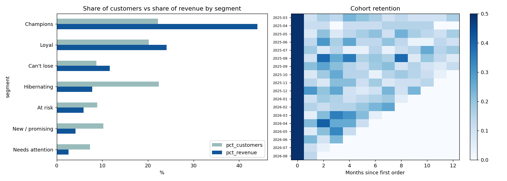

# Customer Segmentation (RFM) & Churn Analysis

RFM segmentation and cohort retention for a Superstore-style retailer, with a Business Analysis case study.



## What's inside
| Path | Description |
|---|---|
| `rfm_analysis.py` | Python pipeline: RFM scoring, 7 segments, cohort retention, charts |
| `rfm_segments.sql` | Same segmentation in SQL (CTEs + `NTILE` window functions) |
| `docs/ba_case_study.md` | BA case study: requirements, process maps, KPIs, recommendations |
| `outputs/` | Generated CSVs and chart |

## Run it
```bash
pip install -r requirements.txt
python rfm_analysis.py                        # synthetic demo data
python rfm_analysis.py Sample-Superstore.csv  # real Superstore data
```
Expected columns: `Customer ID`, `Order ID`, `Order Date`, `Sales`.

## Method
- **Recency** = days since last order; **Frequency** = distinct orders; **Monetary** = total sales.
- Each scored 1-5 by quintile; segments come from R and F rules (Champions, Loyal, Can't lose, At risk, New / promising, Hibernating, Needs attention).
- Cohorts are grouped by first-order month and tracked for 12 months.

## Key findings
> Demo numbers come from synthetic data. Replace with real Superstore results.
- Top ~22% of customers (Champions) drive ~44% of revenue.
- ~17% of customers are high-value but lapsing (Can't lose / At risk): the best win-back target.

## Skills shown
Python (pandas), SQL (window functions), cohort analysis, requirements gathering, process mapping, KPI design.
