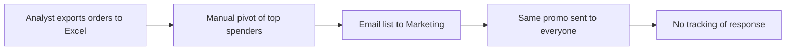
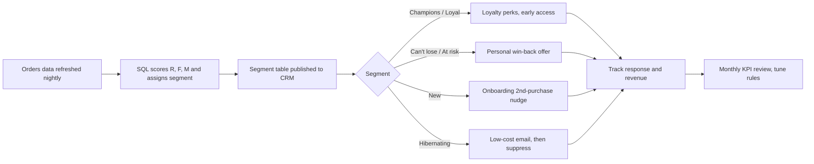

# Business Analysis Case Study: Reducing Customer Churn at an Online Retailer

**Prepared by:** [Your name] | **Date:** 28 Sep 2026 | **Status:** Draft for stakeholder review
**Companion analysis:** RFM segmentation & cohort retention (Python + SQL)

> *Note: the company is a fictional Superstore-style retailer. Figures marked (illustrative) come from a synthetic dataset; swap in real data to finalise.*

---

## 1. Business Problem

Marketing spends the same on every customer, and there is no view of who is drifting away. Repeat customers drive most revenue, but nobody owns reactivation. Lapsed high-value customers are found only when someone runs an ad-hoc report.

**Analysis finding (illustrative):** the top ~22% of customers ("Champions") generate ~44% of revenue, while ~20% of customers are Can't-lose / At-risk / Hibernating, with average recency above 400 days.

## 2. Objectives (SMART)

| # | Objective | Target | By |
|---|-----------|--------|----|
| O1 | Raise 12-month repeat purchase rate | +5 pts | Q2 2027 |
| O2 | Reactivate lapsed high-value customers (Can't lose + At risk) | 15% win-back | Q1 2027 |
| O3 | Cut manual segmentation effort | from 2 days/month to automated | Q4 2026 |

## 3. Stakeholders

| Stakeholder | Role | Interest |
|---|---|---|
| Head of Marketing | Sponsor | Higher ROI per campaign |
| CRM Manager | Primary user | Monthly segment lists |
| Finance Analyst | Reviewer | Campaign cost vs incremental revenue |
| IT / Data Engineering | Delivery | Data pipeline, access controls |
| Customer Service Lead | Consulted | Win-back offer handling |

## 4. Current-State vs Future-State Process

**As-is:** manual, monthly, and no feedback loop.

**To-be:** automated, segmented, measured.

## 5. Requirements

### Functional
| ID | Requirement | Priority (MoSCoW) |
|---|---|---|
| FR-1 | System shall calculate Recency, Frequency and Monetary value per customer nightly | Must |
| FR-2 | System shall assign each customer to one of 7 segments using documented rules | Must |
| FR-3 | CRM shall receive an exportable segment list with customer ID, segment, last order date | Must |
| FR-4 | Dashboard shall show segment size, revenue share and month-on-month movement between segments | Should |
| FR-5 | Cohort retention view by first-order month | Should |
| FR-6 | Campaign response tagged back to customer for uplift measurement | Could |

### Non-functional
| ID | Requirement |
|---|---|
| NFR-1 | Nightly job completes in under 30 minutes |
| NFR-2 | Only Marketing and Analytics roles can access customer-level data (privacy/GDPR-style compliance) |
| NFR-3 | Segment rules are versioned and changes are logged |

### Assumptions & Constraints
- Each customer has a stable ID across orders (guest checkouts excluded).
- Snapshot date is the run date; recency is measured in days.
- No budget for a new CRM tool; use the existing one plus SQL/Power BI.

## 6. Success Metrics (KPIs)

| KPI | Definition | Baseline (illustrative) | Target |
|---|---|---|---|
| Repeat purchase rate | Customers with 2+ orders in 12 months / active customers | 60% | 65% |
| Win-back rate | Reactivated Can't-lose/At-risk customers / targeted | n/a | 15% |
| Month-3 cohort retention | Share of a cohort ordering again in month 3 | see cohort chart | +3 pts |
| Revenue per targeted customer | Campaign revenue / customers contacted | n/a | > campaign cost x 3 |
| Champions share of revenue | Revenue from Champions / total | 44% | Hold or grow |

## 7. Recommendations

1. **Automate the RFM pipeline first** (FR-1 to FR-3). It removes the manual work and unlocks everything else.
2. **Prioritise Can't-lose and At-risk customers**: about 17% of customers, already proven high value, cheapest revenue to recover.
3. **Stop spending on Hibernating customers beyond one low-cost email**, then suppress them.
4. **Run an A/B test** (targeted vs control group) on the first win-back campaign so uplift is measurable, not assumed.
5. **Review segment rules quarterly**; thresholds should reflect real purchase cadence.

## 8. Risks

| Risk | Likelihood | Impact | Mitigation |
|---|---|---|---|
| Poor data quality (duplicate customer IDs) | Medium | High | Data audit before go-live |
| Discounts erode margin on win-back | Medium | Medium | Cap offer value, track profit not just sales |
| Low adoption by CRM team | Low | High | Train users; co-design outputs with the CRM Manager |

## 9. Implementation Roadmap

| Phase | Weeks | Deliverable |
|---|---|---|
| 1. Discovery & data audit | 1-2 | Data dictionary, agreed segment rules |
| 2. Build | 3-5 | SQL pipeline, segment table, dashboard |
| 3. Pilot | 6-8 | A/B win-back campaign |
| 4. Review & scale | 9-10 | KPI review, roll out to all segments |

## 10. Next Steps / Sign-off
Sponsor approval of objectives and segment rules, then start Phase 1.
